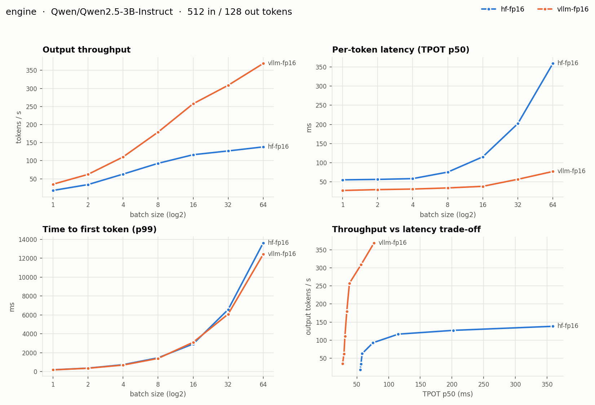
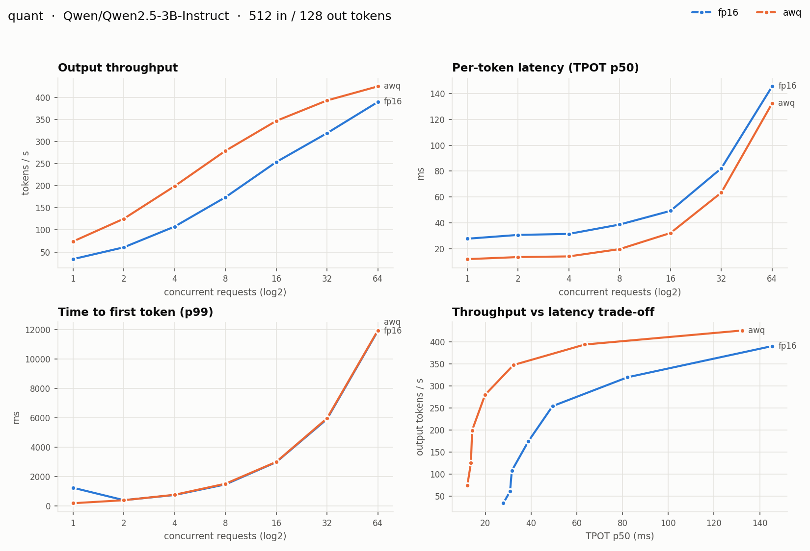
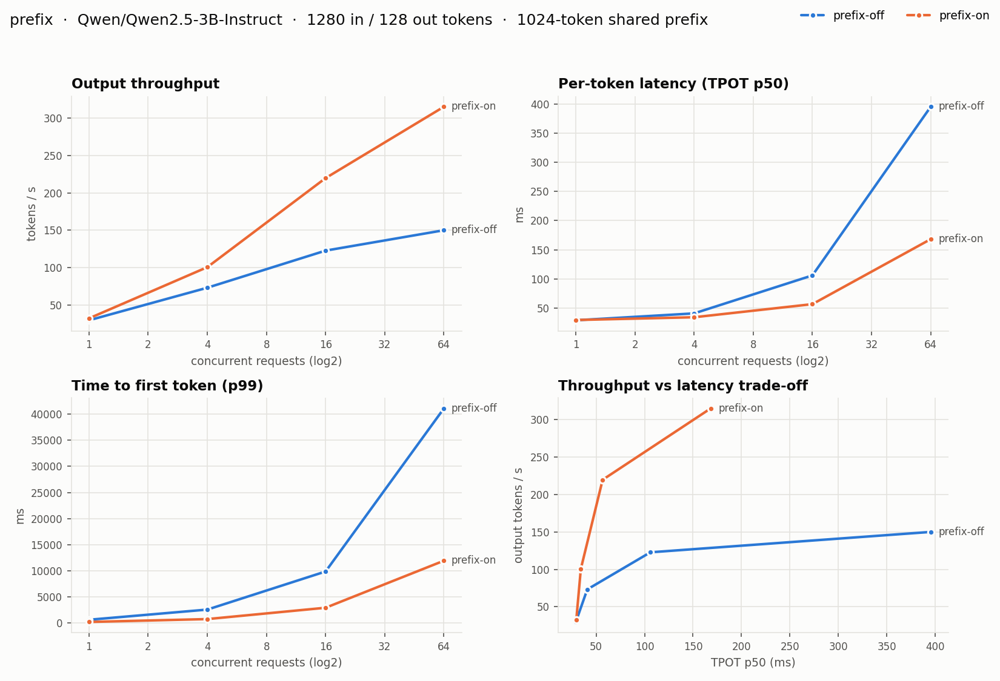
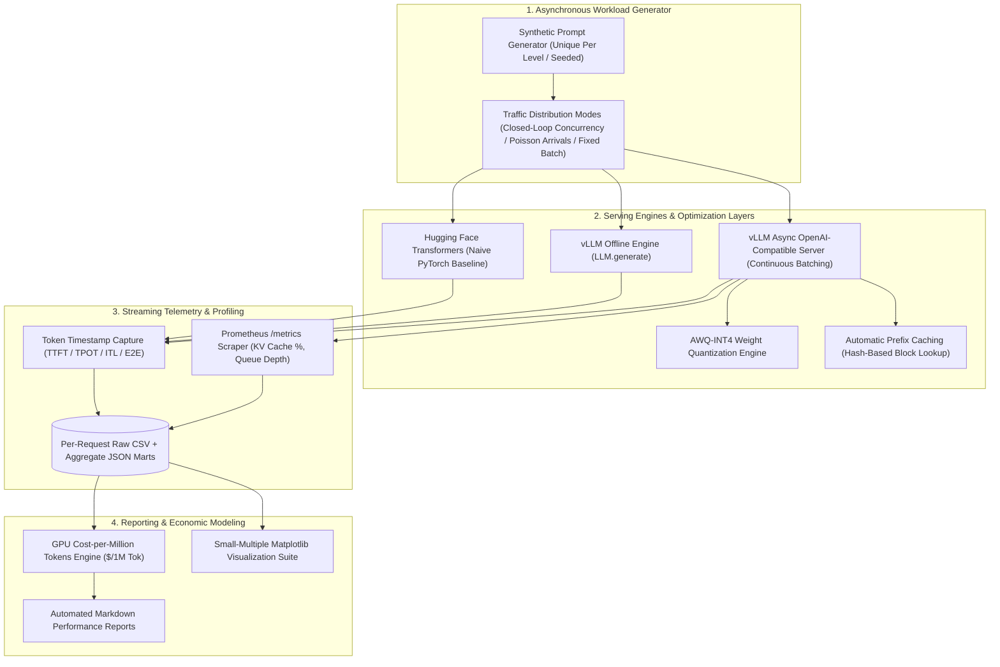

# VELLUM — LLM Inference Benchmarking & Serving Optimization Engine

**VELLUM** is an asynchronous, production-grade benchmarking and telemetry engine designed to profile, optimize, and evaluate open-source LLM serving workloads on NVIDIA GPUs. Built with Python `asyncio`, `aiohttp`, **vLLM** (PagedAttention), PyTorch, and NumPy/Matplotlib, it provides an automated streaming load generator, granular latency profiling (TTFT, TPOT, ITL), live Prometheus KV-cache telemetry, token cost economics ($/1M tokens), and a **1-click GPU execution runner** for Google Colab, Kaggle, or cloud infrastructure.

---

## Benchmark Visualizations & Telemetry



<details>
<summary><b>Click to expand Quantization and Prefix Caching Telemetry Charts</b></summary>

<br>

| Quantization Scaling (FP16 vs. AWQ-INT4) | Prefix Caching Impact (Shared KV Blocks) |
| --- | --- |
|  |  |

</details>

---

## Visual Architecture



---

## Inference Performance & Economic Benchmarks

Measured on a single **16 GB NVIDIA Tesla T4** with vLLM 0.31.0, PyTorch 2.13, and Transformers 5.17 across **36 load levels and 0 failed requests**. Default model: `Qwen/Qwen2.5-3B-Instruct` (FP16) and `Qwen/Qwen2.5-3B-Instruct-AWQ` (INT4) with 512 input tokens and 128 output tokens. Cost calculation utilizes Google Cloud's on-demand T4 list price of **$0.35/hr** (GPU compute only) at 100% saturation. Full tabular data: [`results/Tesla-T4/report.md`](results/Tesla-T4/report.md).

| Benchmark Metric | Measured Performance | Baseline (Standard HF / FP16) | Gain / Reduction | Engineering Analysis |
|---|---|---|---|---|
| **Engine Throughput (Batch 64)** | **369 tok/s** | 138 tok/s (HF Transformers) | **2.67× faster** | PagedAttention eliminates memory fragmentation |
| **Decode Latency (Single User)** | **27.4 ms** / token | 55.2 ms / token (HF) | **2.01× faster** | Fused kernels and custom CUDA execution graphs |
| **AWQ-INT4 Decode (Single User)** | **12.1 ms** / token | 27.9 ms / token (FP16) | **2.31× faster** | 3× fewer weight bytes read per autoregressive step |
| **AWQ-INT4 Throughput (64 Concurrency)**| **425 tok/s** | 390 tok/s (FP16) | **1.09× gain** | Advantage narrows when GPU shifts to compute-bound |
| **Prefix Caching TTFT (Single User)** | **210 ms** | 617 ms (Prefix Off) | **65.9% lower** | 1,024-token shared prompt KV blocks reused |
| **Prefix Caching Throughput (64 Concurrency)** | **315 tok/s** | 150 tok/s (Prefix Off) | **2.10× gain** | Bypasses redundant multi-head attention prefill |
| **Serving Cost Floor ($ / 1M Tokens)** | **$0.23 / 1M** | $5.47 / 1M (HF, batch 1) | **~24× cheaper** | AWQ + Continuous batching at 64 concurrent requests |
| **Cost at 50 ms/token Latency Budget** | **$0.28 / 1M** | $0.38 / 1M (FP16) | **26.3% cheaper** | AWQ at 16 concurrent users meeting tight SLA |

### Key Architectural Findings

1. **The Serving Engine Matters Before Any Tuning**: vLLM cuts per-token latency in half even for a single user (27.4 ms vs 55.2 ms) and widens the gap to a **2.67× throughput gain** at batch 64, where Transformers' per-token latency explodes to 359.2 ms due to quadratic memory overhead.
2. **Quantization is a Latency Win More Than a Throughput Win**: 4-bit AWQ weight quantization reads ~3× fewer bytes from VRAM per token. Decode speeds up **2.3×** when memory bandwidth is the primary bottleneck (low concurrency). At 64 concurrent users, the GPU transitions into a compute-bound state and throughput gains stabilize at 9%.
3. **Continuous Batching is the Dominant Cost Lever**: Scaling from 1 to 64 concurrent requests drives FP16 serving costs down by **11×** ($2.87 → $0.25 / 1M tokens) through saturated matrix-vector compute, at the deliberate trade-off of higher per-token streaming latency (28 ms → 145 ms).
4. **Burst Arrivals Queue on Prefill**: P99 Time-to-First-Token (TTFT) scales almost linearly with concurrency ($\approx 186\text{ ms} \times N$) for both FP16 and AWQ. Prompt prefill processing—not autoregressive decode—dominates tail latency under bursty production traffic.

---

## Key Capabilities

* **Microsecond-Accurate Streaming Profiling**: Streams requests over an OpenAI-compatible SSE interface and timestamps every token chunk, calculating empirical **TTFT** (Time-to-First-Token), **TPOT** (Time-Per-Output-Token), **ITL** (Inter-Token Latency), and end-to-end percentiles ($p_{50}, p_{90}, p_{99}$).
* **Three Flexible Traffic Load Modes**: Closed-loop concurrency (client-side simulation of parallel users), open-loop Poisson request arrivals (production queueing behavior), and fixed batch sizes for deterministic offline comparisons.
* **Rigorous Baseline Benchmarking**: Profiles `transformers.generate()` against `vllm.LLM.generate()` on identical synthetic prompt tensors with uniform timing harnesses, cleanly isolating the impact of PagedAttention, CUDA graph captures, and fused attention kernels.
* **Quantization & KV Caching Experiments**: Deploys FP16 and AWQ-INT4 model variants head-to-head, and evaluates hash-based prefix caching (block-level hash table with parent chaining) on shared system-prompt workloads (1,024 prefix tokens + 256 unique query tokens).
* **Live Prometheus Telemetry Sampler**: Continuously scrapes vLLM's internal `/metrics` endpoint to monitor GPU KV-cache allocation percentage and pending/running request queues during every load level.
* **Token Economic Cost Modeling**: Converts measured throughput into actual infrastructure cost ($/1M output tokens) based on configurable GPU hourly rates.
* **High-Integrity Benchmark Controls**: Generates cryptographically seeded unique prompt sequences per level, enforces `ignore_eos` for fixed-length generation, executes automated warmup rounds to eliminate JIT capture artifacts, and archives complete driver, GPU, and runtime metadata.

---

## Benchmark Experiments & Telemetry Matrix

| Experiment | Compares | Varying Dimension | Key Systems Question |
|---|---|---|---|
| **`engine`** | HF Transformers vs. vLLM (Offline) | Batch size: 1, 2, 4, 8, 16, 32, 64 | What raw throughput and latency gain is achieved by PagedAttention alone? |
| **`quant`** | FP16 vs. AWQ-INT4 (vLLM Server) | Concurrency: 1, 2, 4, 8, 16, 32, 64 | How does 4-bit weight compression impact memory-bandwidth vs compute bounds? |
| **`prefix`** | Prefix Caching Disabled vs. Enabled | Concurrency: 1, 4, 16, 64 | What are the TTFT and throughput savings of caching a 1,024-token system prompt? |

### Measured Metrics & Formulas

| Metric | Captured Dimension | Measurement Formula / Source |
|---|---|---|
| **TTFT** | Time-to-First-Token | $t_{\text{first\_token}} - t_{\text{request\_sent}}$ |
| **TPOT** | Time-Per-Output-Token | $(t_{\text{request\_end}} - t_{\text{first\_token}}) / (N_{\text{output\_tokens}} - 1)$ |
| **ITL** | Inter-Token Latency (Jitter) | $t_{i} - t_{i-1}$ across all streamed output chunks |
| **Throughput**| Output Generation Rate | $\sum N_{\text{output\_tokens}} / t_{\text{wall\_clock\_seconds}}$ |
| **$ / 1M Tokens** | Cost Floor per 1M Tokens | $(\text{GPU \$/hr} / (\text{Throughput} \times 3600)) \times 10^6$ |
| **KV Cache %** | Memory Fragmentation & Fill | Polled from vLLM Prometheus `vllm:gpu_cache_usage_factor` |

---

## Repository Structure

```text
vellum/
├── pyproject.toml              # Build specifications, dependencies, and CLI registration
├── LICENSE                     # MIT License
├── README.md                   # System architecture, benchmarks, and operational guide
├── notebooks/
│   └── colab_runner.ipynb      # 1-Click execution template for Google Colab (Free T4 / L4)
├── results/
│   └── Tesla-T4/               # Measured benchmark artifacts on NVIDIA Tesla T4
│       ├── report.md           # Full markdown performance tables & head-to-head analysis
│       ├── env.txt             # Hardware, driver, CUDA, PyTorch, and vLLM version manifest
│       ├── engine_batch_size.png # Matplotlib small-multiple: HF vs. vLLM scaling
│       ├── quant_concurrency.png # Matplotlib small-multiple: FP16 vs. AWQ-INT4 scaling
│       ├── prefix_concurrency.png# Matplotlib small-multiple: Prefix caching on/off scaling
│       ├── *_requests.csv      # Granular per-request timing logs (TTFT, TPOT, ITL, status)
│       └── *.json              # Aggregated summary statistics per load level
├── scripts/
│   └── run_all.sh              # Orchestration script for server setup, sweeps, and reports
├── tests/
│   ├── conftest.py             # Pytest fixtures and mock server lifecycle management
│   ├── mock_server.py          # Simulated OpenAI-compatible streaming server for CPU testing
│   └── test_harness.py         # End-to-end integration and unit tests for the harness
└── vellum/                     # Core Python package
    ├── __init__.py
    ├── __main__.py             # Package execution entrypoint
    ├── cli.py                  # Terminal CLI (`vellum sweep`, `vellum offline`, `vellum plot`)
    ├── client.py               # Asynchronous streaming client, load generator, and metric aggregation
    ├── offline.py              # Offline generation runners for Transformers and vLLM engines
    ├── plot.py                 # Multi-panel Matplotlib visual rendering engine
    └── report.py               # Automated Markdown summary and comparison table generator
```

---

## Deployment & Execution Options

### Tier 1: 1-Click Free Cloud GPU (Google Colab / Kaggle, $0)

Open [`notebooks/colab_runner.ipynb`](notebooks/colab_runner.ipynb) in Google Colab (or import into Kaggle with **Internet: On**), select a **T4** (Free Tier) or an **L4 / A100** GPU, and execute all cells:

```python
# Colab Quickstart
!git clone -q https://github.com/pr4deepkumar/vellum.git vellum
%cd vellum
!pip install -q uv
!uv pip install --system vllm
!uv pip install --system -e .
!GPU_COST=0.35 bash scripts/run_all.sh
```

Total execution time is approximately **30–45 minutes on an L4** (slightly longer on a T4). The notebook runs all stages, renders charts, prints markdown comparisons, and bundles results for download.

---

### Tier 2: Cloud GPU / Dedicated Host (RunPod, Lambda, AWS, GCP)

Requires Linux and an NVIDIA GPU with $\ge 16\text{ GB}$ VRAM (T4, L4, A10G, A100, H100, RTX 4090).

1. **Clone repository and install dependencies**:
   ```bash
   git clone https://github.com/pr4deepkumar/vellum.git && cd vellum
   pip install uv
   uv pip install --system vllm
   uv pip install --system -e .
   ```

2. **Execute complete benchmark suite** (set `GPU_COST` to your actual host $/hr rate):
   ```bash
   GPU_COST=0.80 bash scripts/run_all.sh
   ```

3. **Or run targeted stages and custom parameters**:
   ```bash
   # Run only quantization and prefix caching experiments
   STAGES="quant prefix" GPU_COST=0.80 bash scripts/run_all.sh

   # Sweep an existing running vLLM OpenAI-compatible server
   vellum sweep --base-url http://localhost:8000 --label prod-fp16 --concurrency 1 4 16 64
   vellum sweep --base-url http://localhost:8000 --label prod-fp16 --request-rate 2 4 8 16

   # Render charts and generate reports
   vellum plot results/
   vellum report results/ --gpu-cost-per-hour 0.80
   ```

---

### Tier 3: Local Laptop Development & Testing (CPU / Mock Server)

VELLUM includes an asynchronous mock streaming server ([`tests/mock_server.py`](tests/mock_server.py)) that mimics vLLM's OpenAI-compatible streaming API. This allows developers to test client harnesses, metric collection, and chart generation locally without requiring an NVIDIA GPU:

```bash
# Create local virtual environment
uv venv && uv pip install -e ".[dev]"

# Execute unit and harness integration test suite
pytest
```

---

## Verification & Testing

The test suite validates mock server generation, client concurrency loops, token timestamp parsing, metric summaries, and reporting pipelines:

```bash
# Run pytest with async support
pytest tests/ -v
```

```text
============================== test session starts ==============================
collected 9 items

tests/test_harness.py::test_tpot_excludes_first_token PASSED             [ 11%]
tests/test_harness.py::test_prompts_are_unique_and_sized PASSED          [ 22%]
tests/test_harness.py::test_parse_metrics_handles_labels_and_both_kv_names PASSED [ 33%]
tests/test_harness.py::test_cost_per_million PASSED                      [ 44%]
tests/test_harness.py::test_run_level_against_mock PASSED                [ 55%]
tests/test_harness.py::test_shared_prefix_is_shared PASSED               [ 66%]
tests/test_harness.py::test_cli_end_to_end PASSED                        [ 77%]
tests/test_harness.py::test_levels_get_fresh_prompts_but_same_prefix PASSED [ 88%]
tests/test_harness.py::test_offline_results_render PASSED                [100%]

============================== 9 passed in 1.17s ===============================
```

---

## License

This project is licensed under the MIT License - see the [LICENSE](LICENSE) file for details.
